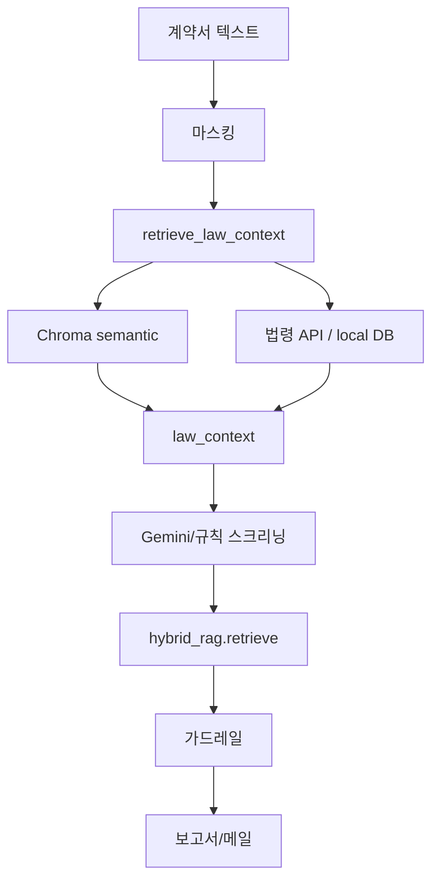
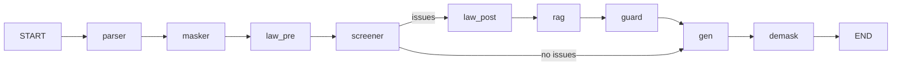

# Deepgle Legal — 법무 계약서 1차 스크리닝

Google AI Agent 예선용 **legal-screening-assistant** 기반 프로젝트입니다.  
프론트(Vite + React + TypeScript)와 FastAPI 백엔드, `LegalScreeningPipeline`으로 PDF/DOCX/TXT 업로드·스크리닝·결과 조회를 제공합니다.  
**Phase 2**: `GEMINI_API_KEY` 설정 시 Gemini 스크리닝·보고서/메일 생성.  
**Phase 3**: Chroma RAG + 국가법령정보센터 API(또는 로컬 법령 DB fallback)로 법령 grounding.  
**Phase 4**: React Query + Dashboard 실 API 데이터 연동 + 마스킹 Side-by-Side.  
**Phase 5**: 오프라인 빌드(`base: './'`), Docker Compose, KPI `/api/metrics`.  
**Phase 7**: LangGraph `StateGraph` 실제 도입 (`backend/graph/workflow.py`).

## 요구 사항

- Node.js 18+
- Python 3.10+

## 빠른 시작 (개발)

### 1. 프론트엔드

```bash
npm install
npm run dev
```

브라우저: http://localhost:5173 — Vite가 `/api`를 `http://127.0.0.1:8000`으로 프록시합니다.

### 2. 백엔드

저장소 루트(`구글_예선`)에서:

```bash
python3 -m venv .venv
source .venv/bin/activate   # Windows: .venv\Scripts\activate
pip install -r backend/requirements.txt
cp .env.example .env        # 선택
PYTHONPATH=. uvicorn backend.main:app --reload --host 127.0.0.1 --port 8000
```

헬스체크: http://127.0.0.1:8000/api/health

## API (Phase 1)

| 메서드 | 경로 | 설명 |
|--------|------|------|
| GET | `/api/health` | 서버 상태 |
| POST | `/api/upload` | multipart `file` (PDF/DOCX/TXT) |
| POST | `/api/screen` | `{ "job_id": "..." }` 동기 스크리닝 |
| GET | `/api/result/{job_id}` | 스크리닝 결과 JSON |
| POST | `/api/email-draft` | `{ "job_id": "..." }` 이메일 초안 |

### curl 예시

```bash
# 헬스
curl -s http://127.0.0.1:8000/api/health | python3 -m json.tool

# 업로드
curl -s -X POST http://127.0.0.1:8000/api/upload \
  -F "file=@fixtures/sample_contract.txt" | python3 -m json.tool

# job_id를 변수에 넣은 뒤 스크리닝 (동기 완료)
JOB_ID="<paste-job-id-here>"
curl -s -X POST http://127.0.0.1:8000/api/screen \
  -H "Content-Type: application/json" \
  -d "{\"job_id\": \"$JOB_ID\"}" | python3 -m json.tool

# 결과 조회
curl -s "http://127.0.0.1:8000/api/result/$JOB_ID" | python3 -m json.tool

# 이메일 초안
curl -s -X POST http://127.0.0.1:8000/api/email-draft \
  -H "Content-Type: application/json" \
  -d "{\"job_id\": \"$JOB_ID\"}" | python3 -m json.tool
```

## 프론트 ↔ 백 연동

- `src/api/client.ts` — `uploadContract`, `runScreen`, `getResult`
- `src/views/Dashboard.tsx` — 파일 선택·드래그 앤 드롭 시 실제 API 호출 (목업 리스크 UI는 Phase 4까지 유지)

업로드 성공 후 브라우저 개발자 도구 **Console** / **Network**에서 `/api/upload`, `/api/screen`, `/api/result` 응답을 확인하세요.

## 백엔드 구조

```
backend/
  main.py
  agent_graph.py       # 파이프라인 (Phase 3: retrieve_law_context)
  law_client.py        # 국가법령정보센터 API (Phase 3)
  llm_client.py        # Gemini (Phase 2)
  prompts.py
  hybrid_rag.py        # Chroma + 키워드 hybrid
  graph/
    workflow.py        # LangGraph compile (Phase 7)
  rag/
    chunking.py
    embedding_service.py
    vector_store.py
    retriever.py
  api/routes/
  services/
  data/chroma/         # Chroma persistence (gitignore)
```

## Phase 요약

| Phase | 핵심 | 상태 |
|-------|------|------|
| 1 | FastAPI, 업로드, 파이프라인 골격 | ✅ |
| 2 | Gemini LLM + fallback | ✅ |
| 3 | RAG + 법령 API grounding | ✅ |
| 4 | Dashboard API 데이터 + React Query | ✅ |
| 5 | 오프라인/Docker/KPI | ✅ |
| 7 | LangGraph StateGraph | ✅ |

## Phase 3 — RAG + Korean Law Retrieval

| Step | 파일 | 역할 |
|------|------|------|
| 1 | `requirements.txt`, `config.py`, `.env` | chromadb, sentence-transformers, `rag_enabled` |
| 2 | `law_client.py` | 국가법령정보센터 API + local_db fallback |
| 3 | `rag/embedding_service.py` | multilingual embeddings |
| 4 | `rag/vector_store.py` | Chroma persistent search |
| 5 | `rag/chunking.py` | 계약서 청킹 |
| 6 | `rag/retriever.py` + `agent_graph` | `retrieve_law_context_node` |
| 7–8 | `prompts.py`, `agent_graph` | grounded screening + report |
| 9 | `health` | `rag_enabled`, `chroma_status`, `embedding_model` |
| 10 | `README`, `scripts/verify_phase3.py` | 문서·검증 |

### RAG 흐름



### `.env` (Phase 3)

```env
LAW_API_KEY=your_oc_code
CHROMA_DIR=backend/data/chroma
EMBEDDING_MODEL=paraphrase-multilingual-MiniLM-L12-v2
USE_RAG=true
```

### 검증

```bash
pip install -r backend/requirements.txt
PYTHONPATH=. python scripts/verify_phase3.py
```

예상 로그: `OK P3-Step1` … `OK P3-Step10`

```bash
curl -s http://127.0.0.1:8000/api/health | python3 -m json.tool
```

### Troubleshooting

| 증상 | 조치 |
|------|------|
| `rag_enabled: false` | `pip install chromadb sentence-transformers`, 첫 실행 시 모델 다운로드 대기 |
| Chroma 느림 | `backend/data/chroma/` 삭제 후 재시드 |
| 법령 API 빈 결과 | `LAW_API_KEY`(OC) 설정 또는 local_db fallback 정상 동작 확인 |
| LLM 없음 | `USE_LLM=false`여도 규칙+RAG 맥락으로 파이프라인 계속 |

## Phase 2 — Gemini LLM

| Step | 파일 | 역할 |
|------|------|------|
| 1 | `requirements.txt`, `.env.example` | `google-generativeai` 의존성 |
| 2 | `config.py` | `GEMINI_*`, `USE_LLM`, `llm_enabled` |
| 3 | `llm_client.py` | Gemini 호출·JSON 파싱 |
| 4 | `prompts.py` | 스크리닝·보고서 프롬프트 |
| 5–7 | `agent_graph.py` | Screener/Generator 노드 LLM + fallback |

`.env` 예시:

```env
GEMINI_API_KEY=your_key_here
GEMINI_MODEL=gemini-2.0-flash
USE_LLM=true
```

- API 키 없음 또는 `USE_LLM=false` → Phase 1과 동일한 **규칙 기반** 스크리닝
- LLM 호출 실패 시 자동 **규칙 fallback** (서버 500 방지)
- `GET /api/health` 응답의 `llm_enabled`로 LLM 사용 여부 확인

```bash
curl -s http://127.0.0.1:8000/api/health | python3 -m json.tool
# "llm_enabled": true 이면 Gemini 경로 활성
```

## 환경 변수 (`.env.example`)

- `API_HOST`, `API_PORT`, `CORS_ORIGINS`
- `MAX_UPLOAD_BYTES` (기본 10MB)
- `GEMINI_API_KEY`, `GEMINI_MODEL`, `USE_LLM`
- `LAW_API_KEY`, `CHROMA_DIR`, `EMBEDDING_MODEL`, `USE_RAG`

## Phase 1 체크리스트

- [ ] `curl http://127.0.0.1:8000/api/health` → 200
- [ ] `.txt` / `.pdf` / `.docx` upload → `job_id` + `text_preview`
- [ ] `POST /api/screen` → `output_report` 비어 있지 않음
- [ ] `GET /api/result/{job_id}` → `verified_issues` 배열
- [ ] 프론트 파일 업로드 → Network `/api/upload` 200
- [ ] CORS 에러 없음 (5173 ↔ 8000 또는 Vite proxy)

## Phase 4 — Dashboard API 연동

| Step | 파일 | 역할 |
|------|------|------|
| 1 | `@tanstack/react-query`, `QueryProvider` | 서버 상태·캐시 |
| 2 | `src/lib/mapScreeningResult.ts` | API → UI `ContractData` 매핑 |
| 3 | `src/hooks/useScreening.ts` | upload→screen→result mutation |
| 4 | `Dashboard.tsx` | 목업 대신 API 리스크·점수·보고서 |
| 5 | `MaskingCompare.tsx` | 원문 vs `contract_masked` |

- 업로드 전: 기존 `sampleContract` 데모 UI 유지
- 업로드 후: `verified_issues`, `safety_score`, `output_report` 반영
- `contract_masked` 있으면 Viewer에 Side-by-Side 표시

```bash
npm run dev
# 터미널 2: PYTHONPATH=. uvicorn backend.main:app --reload --port 8000
```

## Phase 5 — 오프라인 · Docker · KPI

| Step | 파일 | 역할 |
|------|------|------|
| 1 | `vite.config.ts` `base: './'` | 상대 경로 오프라인 dist |
| 2 | `docker-compose.yml`, `docker/*` | backend + nginx frontend |
| 3 | `services/metrics.py`, `GET /api/metrics` | 업로드/스크리닝 KPI |
| 4 | `scripts/benchmark_kpi.py` | SLA 벤치마크 (기본 180초) |
| 5 | `scripts/verify_phase5.py` | Phase 5 자동 검증 |

### 오프라인 빌드

```bash
npm run build:offline
npm run preview:offline   # http://127.0.0.1:4173
```

`dist/index.html`을 열 때는 API 없음 — **Docker 또는 dev+uvicorn**으로 API 제공 필요.

### Docker Compose

```bash
cp .env.example .env   # GEMINI_API_KEY 등 선택
docker compose up --build
```

- 프론트: http://localhost:8080 (nginx → `/api` → backend)
- API 직접: http://localhost:8000/api/health

### KPI / SLA

```bash
curl -s http://127.0.0.1:8000/api/metrics | python3 -m json.tool
PYTHONPATH=. python scripts/benchmark_kpi.py
```

`SCREEN_SLA_SECONDS`(기본 180) 이내 스크리닝이면 `sla_met_last: true`.

```bash
PYTHONPATH=. python scripts/verify_phase5.py
```

## Phase 7 — LangGraph StateGraph

| Step | 파일 | 역할 |
|------|------|------|
| 1 | `langgraph`, `langchain-core` in requirements | 의존성 |
| 2 | `backend/graph/workflow.py` | `StateGraph` 노드·조건부 엣지 정의 |
| 3 | `agent_graph.py` | `graph.invoke()` (fallback: 수동 `run`) |
| 4 | `GET /api/health` → `langgraph_enabled` | FastAPI 연동 확인 |

### 그래프 흐름



### 설정

```env
USE_LANGGRAPH=true   # false면 Phase 1~6 수동 오케스트레이션
```

```bash
pip install -r backend/requirements.txt
curl -s http://127.0.0.1:8000/api/health | python3 -m json.tool
# "langgraph_enabled": true 확인

PYTHONPATH=. USE_LLM=false python scripts/verify_phase7.py
```

## 원본 템플릿

아래는 Vite React 템플릿 기본 ESLint 안내입니다.

Currently, two official plugins are available:

- [@vitejs/plugin-react](https://github.com/vitejs/vite-plugin-react/blob/main/packages/plugin-react) uses [Oxc](https://oxc.rs)
- [@vitejs/plugin-react-swc](https://github.com/vitejs/vite-plugin-react/blob/main/packages/plugin-react-swc) uses [SWC](https://swc.rs/)
